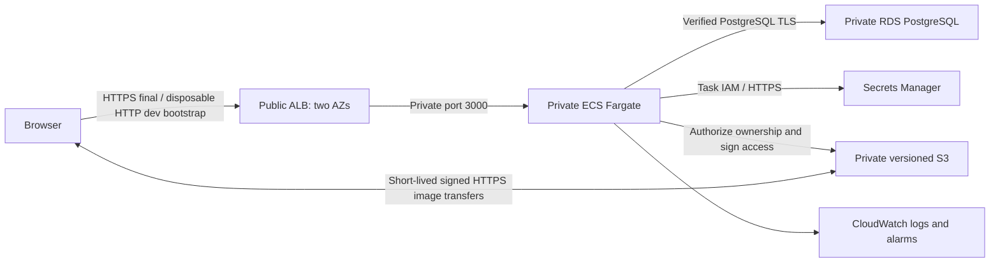

# Godiffy — CloudPay platform assessment

A deliberately small photo-gallery application with a production-oriented AWS
platform. The assessment emphasis is **Terraform design, security boundaries,
operability, and defensible trade-offs**, not application complexity.

## Current status

- **Deployed and verified:** dedicated Godiffy S3 Terraform backend, native state
  locking, versioning, encryption, and six bootstrap resources. Local backups retained.
- **Built, not deployed:** Bun/TanStack application, PostgreSQL bootstrap/migration
  jobs, Docker image, dev/prod Terraform, validation CI, and runbooks.
- **Saved plans, not applied:** dev foundations **72 additions**; production
  foundations **76 additions**. Both have **zero changes and zero deletions**.
- No Portyard application infrastructure, existing OIDC permissions, production
  application resources, or DNS records were changed. No deployment workflow is enabled.
- **DEV deployment authorized, authentication blocked:** the `portyard` SSO session
  expired and AWS rejected its refresh token. See [dev deployment status](docs/dev-deployment.md).
- Plans/state/dependencies and all credentials are excluded from Git.

DEV-only autonomous deployment is now authorized within the agreed architecture
and safety limits, but has not started without valid AWS authentication. Production
and domain/TLS work remain unauthorized. This is not a claim of a running AWS app.

## Design in brief



Dev intentionally has one task, Single-AZ RDS, and one endpoint AZ. Production is
designed for two task AZs, two minimum replicas, Multi-AZ RDS, and endpoints in both
AZs. There are no NAT gateways, public task IPs, Redis, Kubernetes, or external
runtime SaaS dependencies in the draft.

## Review and operate

| Document | Purpose |
| --- | --- |
| [Architecture](docs/architecture.md) | Boundaries, modules, decisions and six Well-Architected pillars |
| [Review handoff](docs/review.md) | Evidence, plan identities, outstanding approvals and next steps |
| [Dev deployment status](docs/dev-deployment.md) | Current authorization, authentication blocker and rollout checklist |
| [Interview notes](docs/interview.md) | What is actually deployed versus tested locally or only designed |
| [Costs](docs/costs.md) | Official London prices, assumptions and endpoint/NAT comparison |
| [Operations](docs/operations.md) | Staged deployment, verification, rollback, recovery and TLS last |
| [Delivery security](docs/delivery.md) | Validation now; proposed OIDC privilege and production approval boundaries |
| [State backend](docs/terraform-state.md) | Live backend, migration record, locking and access controls |
| [Application](app/README.md) | Runtime/job contracts, local tests and known security limits |
| [OIDC bootstrap](docs/aws-oidc.md) | Existing authentication-only setup, unchanged |

## Local verification

Terraform `1.16.5`, AWS provider `6.67.0`, Bun `1.4.2`, Python 3 and Docker.
The existing Nix shell provides AWS CLI, Terraform, actionlint and ShellCheck.

```sh
nix-shell
bash scripts/verify.sh
bun scripts/test-database.ts
cd app
bun run test:built
cd ..
actionlint .github/workflows/*.yml
shellcheck scripts/verify.sh
```

`verify.sh` isolates cached backend metadata, disables backend initialization and
uses mocked AWS providers only;
it does not need AWS credentials. The PostgreSQL test runs an isolated local
container with ephemeral credentials and mocked AWS services, then stops only its
own container. Docker build context is `app/`.

Production registration is intentionally disabled: a dev email allowlist is not
proof of inbox ownership. Actual AWS image pulls, RDS master permissions, S3
POST/CORS and ALB behavior require an approved staging rollout.
