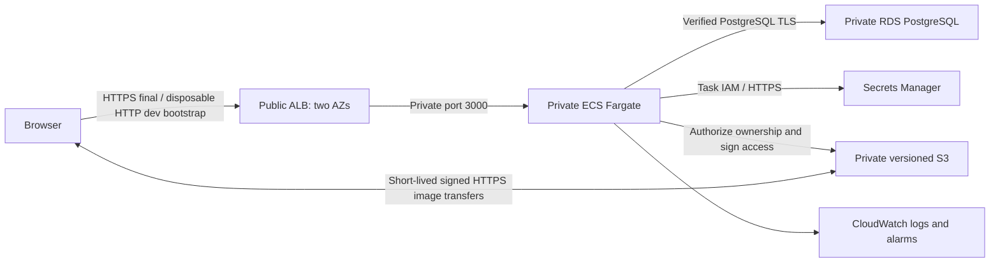

# Godiffy — CloudPay platform assessment

A small **Terraform interview demo**. The photo gallery proves the AWS resources
work together; the emphasis is modules, remote state, reviewed plans, IAM and
GitHub Actions delivery—not application complexity or production certification.

## Current status

- **Deployed and verified:** dedicated Godiffy S3 Terraform backend, native state
  locking, versioning, encryption, and six bootstrap resources. Local backups retained.
- **DEV is running:** [HTTP ALB URL](http://godiffy-dev-alb-1345285825.eu-west-2.elb.amazonaws.com).
  Database jobs and real login/S3 upload/download/ownership/delete checks passed.
  [Release run 37691404457](https://github.com/MichaelFisher1997/Cloudpay-demo/actions/runs/37691404457)
  applied **8 additions, 1 in-place update, 0 deletions** and finished with **no changes**.
- **Production remains undeployed:** its historical 76-addition foundation plan
  is design evidence, not authorization or a current apply input.
- No Portyard application infrastructure, production application resources or DNS
  records were changed.
- **DEV-only Actions delivery:** Nine exact DEV
  policies (five CI scopes and four task boundaries) were human-bootstrapped onto
  the deliberately reused OIDC role; its trust/profile are unchanged. Application
  deployment uses manual plan/apply/image Actions workflows only.
  See [dev deployment status](docs/dev-deployment.md).
- Plans/state/dependencies and all credentials are excluded from Git.
- **GitHub validation passed:** [run 37690611200](https://github.com/MichaelFisher1997/Cloudpay-demo/actions/runs/37690611200)
  tests/builds the actual committed implementation without AWS credentials.

DEV is intentionally HTTP-only: use disposable passwords and non-sensitive images.
Production and domain/TLS work remain unauthorized. Do not interpret process-only
health probes, local mocks or a scan as proof of production readiness.

## Five-minute interview demo

1. Open the site; register `interview@godiffy.invalid` with a **disposable** password,
   then upload/download/delete a non-sensitive image.
2. Walk through `terraform/environments/dev` and the focused modules in
   `terraform/modules`: networking, storage, database and application.
3. Show the Actions release's reviewed plan, successful apply and final **no-change**
   plan. The app is evidence of the infrastructure, not the main presentation.
4. Explain S3 remote state/native locking, private tasks/RDS, separate task roles,
   OIDC without permanent keys, and the deliberate one-task/Single-AZ cost trade-off.
5. State the estimated **$100–170/month** envelope and separately approved
   [teardown](docs/teardown.md). Production, browser/load/restore and task-recovery
   testing are not claimed.

## Design in brief



Dev intentionally has one task, Single-AZ RDS, and one endpoint AZ. Production is
designed for two task AZs, two minimum replicas, Multi-AZ RDS, and endpoints in both
AZs. There are no NAT gateways, public task IPs, Redis, Kubernetes, or external
runtime SaaS dependencies in DEV.

## Review and operate

| Document | Purpose |
| --- | --- |
| [Architecture](docs/architecture.md) | Boundaries, modules, decisions and six Well-Architected pillars |
| [Historical review](docs/review.md) | Earlier build-and-plan evidence, not the current inventory |
| [DEV handoff](docs/dev-deployment.md) | Actual inventory, digest, AWS results and verification limits |
| [Interview notes](docs/interview.md) | What is actually deployed versus tested locally or only designed |
| [Costs](docs/costs.md) | Official London prices, assumptions and endpoint/NAT comparison |
| [Operations](docs/operations.md) | Staged deployment, verification, rollback, recovery and TLS last |
| [Delivery security](docs/delivery.md) | Actions-only DEV rollout, IAM limits and separate production approvals |
| [DEV teardown](docs/teardown.md) | Exact retirement scope, data/protection safeguards and separate approval |
| [State backend](docs/terraform-state.md) | Live backend, migration record, locking and access controls |
| [Application](app/README.md) | Runtime/job contracts, local tests and known security limits |
| [OIDC bootstrap](docs/aws-oidc.md) | Original identity bootstrap; DEV delivery scope is recorded separately |

## Local verification

Terraform `1.16.5`, AWS provider `6.67.0`, Bun `1.4.2`, Python 3 and Docker.
The existing Nix shell provides AWS CLI, Terraform, actionlint and ShellCheck.

```sh
nix-shell
bash scripts/verify.sh
bun scripts/test-database.ts
cd app
bun run test:built
cd ..
actionlint .github/workflows/*.yml
shellcheck scripts/verify.sh
```

`verify.sh` isolates cached backend metadata, disables backend initialization and
uses mocked AWS providers only;
it does not need AWS credentials. The PostgreSQL test runs an isolated local
container with ephemeral credentials and mocked AWS services, then stops only its
own container. Docker build context is `app/`.

Production registration is intentionally disabled: a dev email allowlist is not
proof of inbox ownership. Actual AWS image-pull, database, S3 and ALB verification
is recorded separately from local tests in the deployment handoff.
